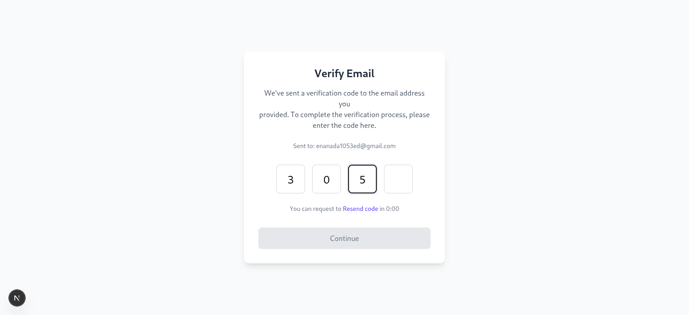
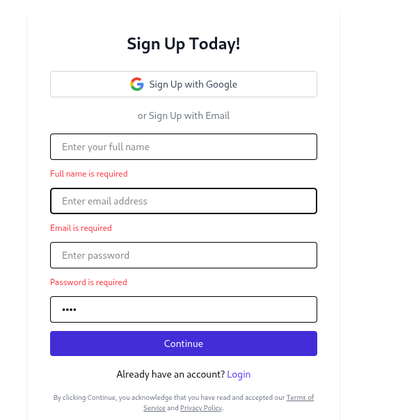

# Auth-Enabled User Access App

A modern authentication system built with **Next.js 14**, **Google OAuth via NextAuth**, **Tailwind CSS**, and **Redux Toolkit Query**. The app includes signup, sign-in, and email verification workflows for a seamless user experience.

---

## 🚀 Features

- **Google OAuth Signup/Login** – Sign in securely using your Google account via NextAuth
- **Email/Password Signup & Verification** – Traditional sign-up with a verification step before login
- **Redux Toolkit Query Integration** – Efficient API communication and error handling
- **Responsive UI with Tailwind** – Mobile-first, consistent and clean design
- **Modular Structure** – Easily extendable component and API design
- **Client-Side Navigation** – Seamless experience using `next/navigation` and `useRouter`

---

## 📄 Main Pages

### ✅ Signup Page

- Google and email-based signup options  
- Real-time validation (React Hook Form)  
- On success, redirects to `/verify?email=user@example.com`  

### 🔐 Signin Page

- Error feedback if login fails

### 📧 Email Verification Page

- Users enter the verification code sent to their email  
- Includes a **resend code** feature  
- On success, redirects to login

---

## 🧩 Tech Stack

| Tool            | Purpose                                |
|-----------------|----------------------------------------|
| **Next.js**     | React framework for building the app   |
| **NextAuth.js** | Authentication (Google + custom)       |
| **Redux Toolkit Query** | State + async API logic         |
| **Tailwind CSS**| Styling and layout                     |
| **React Hook Form** | Form validation and handling       |
| **TypeScript** *(optional)* | You can easily add TS for safety |

---

## 📁 Project Structure

app/
signup/page.js
signin/page.js
verify/page.js

app/api/
auth/
[...nextauth]/route.js # NextAuth config

store/
api/
authApi.js # Redux Query endpoints


public/
(Assets like logos or SVGs)

## 🖼️ Screenshots

### Signup with Google


### Verify Email OTP



### Signin Page


### On success login


### Error Handling 



---

## 🛠️ How to Run Locally

Make sure you have **Node.js** and **npm** installed.

```bash
# Clone the repository
git clone https://github.com/your-username/your-auth-app.git
cd your-auth-app

# Install dependencies
npm install

# Set up environment variables
cp .env.example .env.local
# Fill in your Google OAuth credentials and backend API URL

# Run the dev server
npm run dev
